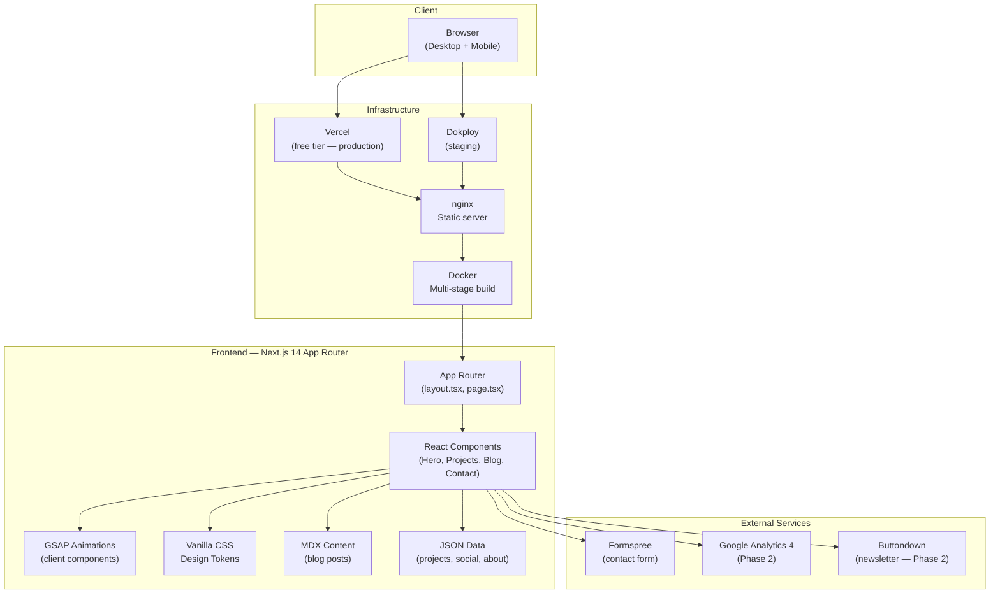

# Architecture — CK Personal Portfolio

> System design, component structure, infra topology, and the 5-layer agent model.
> Updated: 2026-08-01

---

## System Overview



---

## Page Structure (Next.js App Router)

```
src/app/
├── layout.tsx           # Root layout: fonts, global CSS, metadata
├── page.tsx             # Home: Hero + About + Projects preview + Contact
├── projects/
│   └── page.tsx         # Full projects listing
├── blog/
│   ├── page.tsx         # Blog listing (all posts)
│   └── [slug]/
│       └── page.tsx     # Individual blog post (MDX)
└── api/                 # API routes (Phase 2 — if needed)
```

---

## Component Architecture

```
src/components/
├── layout/
│   ├── Header.tsx       # Navigation + hamburger menu
│   └── Footer.tsx       # Social links + copyright
├── sections/
│   ├── Hero.tsx         # Video hero (GSAP — 'use client')
│   ├── About.tsx        # Profile section
│   ├── Projects.tsx     # Project grid
│   ├── Blog.tsx         # Blog post listing
│   └── Contact.tsx      # Formspree contact form
├── ui/
│   ├── ProjectCard.tsx  # Reusable project card
│   ├── PostCard.tsx     # Reusable blog post card
│   └── SocialLinks.tsx  # Social platform link list
└── providers/
    └── GSAPProvider.tsx # Reduced-motion context
```

---

## Data Layer

```
src/data/
├── projects.json        # Project entries (id, title, desc, tags, urls, image)
├── social.json          # Social platform links (platform, url, icon)
└── about.json           # Profile data (bio, skills, experience)

src/content/
└── posts/
    └── YYYY-MM-DD-slug.mdx  # Blog posts with frontmatter
```

---

## Infrastructure Topology

```
Developer (CK)
     │
     ▼ git push origin feat/...
GitHub (yck30/YCK_Portfolio)
     │
     ├──▶ PR Review (CK approves)
     │         │
     │         ▼ merge to main
     │    Vercel CI (auto-deploy)
     │         │
     │         ▼
     │    Vercel CDN ──▶ Production URL
     │
     └──▶ Manual Docker build
               │
               ▼
          Docker Registry
               │
               ▼
           Dokploy ──▶ Staging URL
```

---

## 5-Layer Agent Model

```
┌─────────────────────────────────────────────────┐
│  Layer 1: CONSTITUTION (.agent/constitution.md) │
│  → Master rules, RACI, zero-trust defaults      │
├─────────────────────────────────────────────────┤
│  Layer 2: SKILLS (.agent/skills/)               │
│  → Playbooks: feature, review, deploy, security │
├─────────────────────────────────────────────────┤
│  Layer 3: HOOKS (.agent/hooks/)                 │
│  → Guards: pre-execution, pre-deploy, post-deploy│
├─────────────────────────────────────────────────┤
│  Layer 4: SUBAGENTS (.agent/subagents/)         │
│  → CI · Security/PenTest · UX/QA · DevOps · Content │
├─────────────────────────────────────────────────┤
│  Layer 5: MEMORY (.agent/memory/)               │
│  → Context · ADRs · Security posture log        │
└─────────────────────────────────────────────────┘
              ▲ All governed by ▼
         CK (Human Accountable)
```

---

## Design System

### Color Tokens (CSS Custom Properties)
```css
:root {
  /* Neutrals */
  --color-black: #000000;
  --color-white: #ffffff;
  --color-surface: rgba(255, 255, 255, 0.06);
  --color-border: rgba(255, 255, 255, 0.12);

  /* Typography */
  --color-text-primary: rgba(255, 255, 255, 0.92);
  --color-text-secondary: rgba(255, 255, 255, 0.55);
  --color-text-accent: rgba(255, 255, 255, 0.8);

  /* Spacing Scale */
  --space-1: 0.25rem;
  --space-2: 0.5rem;
  --space-4: 1rem;
  --space-8: 2rem;
  --space-16: 4rem;
  --space-24: 6rem;

  /* Typography Scale */
  --text-xs: 0.75rem;
  --text-sm: 0.875rem;
  --text-base: 1rem;
  --text-lg: 1.125rem;
  --text-xl: 1.25rem;
  --text-2xl: 1.5rem;
  --text-4xl: 2.25rem;
  --text-6xl: 3.75rem;

  /* Motion */
  --ease-out: cubic-bezier(0.16, 1, 0.3, 1);
  --duration-fast: 200ms;
  --duration-base: 400ms;
  --duration-slow: 700ms;
}
```

---

## Key Architectural Decisions

See `memory/decisions.md` for full ADR log.

| ADR | Decision | Rationale |
|---|---|---|
| ADR-002 | Next.js 14 App Router | SSR, SEO, routing for blog |
| ADR-004 | Vanilla CSS (no Tailwind) | Precision control for Cinematic aesthetic |
| ADR-006 | MDX for blog | Zero-cost, git-based CMS |
| ADR-007 | Docker + nginx | Dokploy compatibility |
| ADR-009 | 5-layer agent model | Governance for AI-assisted solo dev |

---

## Performance Targets

| Metric | Target |
|---|---|
| Lighthouse Mobile Performance | ≥ 85 |
| LCP (Largest Contentful Paint) | ≤ 2.5s |
| CLS (Cumulative Layout Shift) | ≤ 0.1 |
| FID / INP | ≤ 200ms |
| Bundle Size (JS) | ≤ 150KB gzipped |
